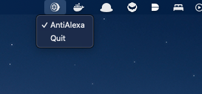

# LeMenuAide

LeMenuAide (pronounced _lemonade_) is a simple desktop assistant, which sits in your MacOS menu bar and lets your control your custom automations. It's easy to add modular functionality to the assistant. Although this was targeting MacOS, the code and libraries are compatible with windows and linux as well.

<br/>



## AntiAlexa

This is the first feature (and main reason for this project) built in, to deal with annoying msgs from Amazon Echo, once it wakes up to connect to your PC. The name and soltuion (and the sound file) are adapted from LucaBarile's [AntiAlexa](https://github.com/LucaBarile/AntiAlexa) project in C# targetting windows along with the [blog post](https://lucabarile.github.io/Blog/antialexa/index.html) about it.


## Building and running
```
cd lemenuaide
go build
go run .
```


